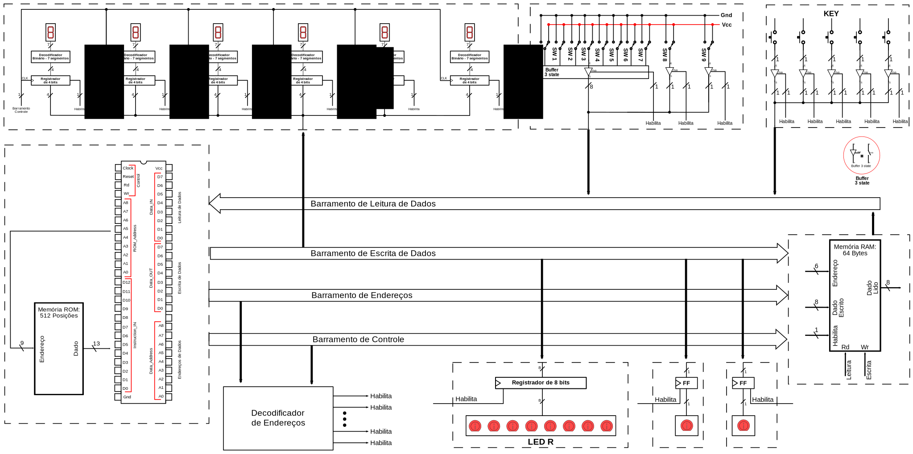

# Desing de Computadores

Antonio Fonseca

Joras Custodio 

# Projeto 1

## 

### Arquitetura

O projeto segue o diagrama abaixo, a partir de um processador, que possui uma memoria ROM interna com instruções, e se comunica com memoria RAM e os endereços de IO por quatro barramento, sendo eles de Leitura e Escrita de dados, de Endereçamento e Controle.

Inputs e Outputs:

| Nome | Quantidade | Endereço |
| --- | --- | --- |
| RAM | 64 | 0-63 |
| 7 Segmentos | 6 | 288-293 |
| Leds | 10 | 256-258 |
| Chaves | 10 | 320-322 |
| Botões | 5 | 352-356 |

Conecções com os barramentos:

### Processador

O processador utiliza uma ULA com 4 operações, soma, subtração, passa e comparação, e opera entre um registrador e a saida de um MUX, que direciona ou a saida da memoria RAM ou o valor do Imediato da intrução, salvando a saida sempre no mesmo registrador da entrada A.

Para o controle das instruções é utilizado um registrador tambem de 8 bits (PC) para guardar a posição atual da memoria ROM, e pode ter seu valor manipulado por um MUX descrito na tabela a baixo

| 0 | PC +1 |
| --- | --- |
| 1 | Imediato |
| 2 | End. Retorno |

### Intruções:

| Função | Mnemonio | Binario |
| --- | --- | --- |
| Sem Operação | NOP | 0000 |
| Carrega valor da memória para A | LDA | 0001 |
| Soma A e B e armazena em A | SOMA | 0010 |
| Subtrai B de A e armazena em A | SUB | 0011 |
| Soma A e o Imediato e armazena em A | SOMI | 1011 |
| Subtrai A e o Imediato e armazena em A | SUBI | 1100 |
| Carrega valor imediato para A | LDI | 0100 |
| Salva valor de A para a memória | STA | 0101 |
| Desvio de execução | JMP | 0110 |
| Desvio condicional de execução | JEQ | 0111 |
| Comparação | CEQ | 1000 |
| Chamada de Sub Rotina | JSR | 1001 |
| Chamada de Sub Rotina Condicionada | JSQ | 1101 |
| Retorno de Sub Rotina | RET | 1010 |

## Contador

Desenvolvimento de um processador em arquitetura Harvard de 8 bits em modelo Registrador-Memória. O projeto inicial do contador é capaz de ler um botão precionado na FPGA e mostrar  a contagem de clicks em displays de 7 segmentos

## Relogio