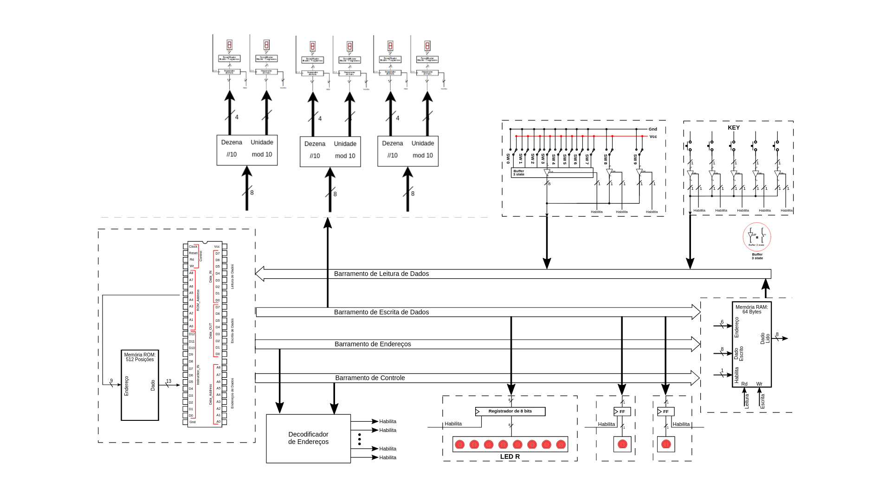
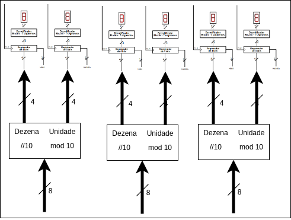

# Desing de Computadores

Antonio Fonseca

Jorás Custodio 

# Projeto 1

### Arquitetura

O projeto segue a arquitetura Harvard, com barramentos e memoria de 8 bits, em um modelo Registrador-Memoria, como mostra o diagrama abaixo, possuindo uma memoria ROM interna com instruções, e se comunica com memoria RAM e os endereços de IO por quatro barramento, sendo eles de Leitura e Escrita de dados, de Endereçamento e Controle.

### Processador

O processador utiliza uma ULA com 4 operações, soma, subtração, passa e comparação, e opera entre um registrador e a saída de um MUX, que direciona ou a saída da memoria RAM ou o valor do Imediato da instrução, salvando a saída sempre no mesmo registrador da entrada A.

Para o controle das instruções é utilizado um registrador também de 8 bits (PC) para guardar a posição atual da memoria ROM, e pode ter seu valor manipulado por um MUX descrito na tabela a seguir.

| 0 | PC +1 |
| --- | --- |
| 1 | Imediato |
| 2 | End. Retorno |

A memoria ROM foi construída com 4 bits para codificar instruções e mais 9 bits para endereçamento na RAM ou para valor Imediato, sendo os quatro bits de instruções direcionados para o decodificador de instruções, responsável pela ativação dos pontos de controles que espalhados por todo o processador, representados pelas linhas em vermelho na imagem abaixo.


# **Computador**

O diagrama abaixo mostra as conexões com os quatro barramentos principais realizadas no arquivo Top-Level e o decodificador de instruções, componente responsável por habilitar o componente adequado para que não haja conflito nos barramentos de leitura e escrita.

| Nome | Quantidade | Endereço |
| --- | --- | --- |
| RAM | 64 | 0-63 |
| 7 Segmentos | 6 | 288-293 |
| Leds | 10 | 256-258 |
| Chaves | 10 | 320-322 |
| Botões | 5 | 352-356 |



A principal  mudança no hardware implementada foi a adição de uma unidade logica entre o barramento d escrita e os displays de 7 segmentos, fazendo com que seja transmitido um único numero em 8 bits, que é convertido para 2 barramentos de 4 bits, um contento a unidade e outro a dezena da representação decimal do valor inicial. Com isso, os 6 displays passam a operar em duplas, sempre mostrando as duas partes de um mesmo número. A principal vantagem desse componente foi o a simplificação do código, podendo que os mostradores de segundo, minutos e horas sejam armazenadas com um em um único endereço de memoria



Seguindo a arquitetura Registrador-Memoria, é necessário endereçar além da instrução e do imediato, um dos 4 registradores para ser utilizado na instrução, mesmo que a instrução não de fato utilize registradores, pelo barramento é preciso endereçar, fazendo com que a instrução tenha o formato abaixo, com a diferença que no processor do projeto, o endereço da RAM possui o mesmo tamanho da ROM, sendo descartáveis os bits 10 e 11 da imagem


A tabela abaixo mostra as instruções implementadas para o projeto, e os respectivos Mnemônicos, que nada mais são do que abreviações utilizadas para a programação em assembly.

### Intruções:

| Função | Mnemônico | Binário |
| --- | --- | --- |
| Sem Operação | NOP | 0000 |
| Carrega valor da memória para A | LDA | 0001 |
| Soma A e B e armazena em A | SOMA | 0010 |
| Subtrai B de A e armazena em A | SUB | 0011 |
| Soma A e o Imediato e armazena em A | SOMI | 1011 |
| Subtrai A e o Imediato e armazena em A | SUBI | 1100 |
| Carrega valor imediato para A | LDI | 0100 |
| Salva valor de A para a memória | STA | 0101 |
| Desvio de execução | JMP | 0110 |
| Desvio condicional de execução | JEQ | 0111 |
| Comparação | CEQ | 1000 |
| Chamada de Sub Rotina | JSR | 1001 |
| Chamada de Sub Rotina Condicionada | JSQ | 1101 |
| Retorno de Sub Rotina | RET | 1010 |

### Assembler

O assembler é um programa em python que recebe um arquivo de texto com um código assebly e retorna um bloco que é entendido pelo Quartus como os endereços da memoria ROM. A execução deve seguir o formato “ python3 [assembler.py](http://assembler.py) input.txt output.txt”

O loop principal do programa varre um for entre as linhas no input, e discriminando o tratamento da linha pelo numero de argumento nela presente

```
for line in f:
        line, coment = filtra(line)
        if len(line) == 1:
            if line[0] in mnemonics:
                linha_nova = mnemonics[line[0]] + 11*"0"
            else:
                pulos[line[0]] = contador
                linha_nova = 15*"0"
        elif len(line) == 2:
            if line[1][0] in ['@', '$']:
                end = bin(int(line[1][1:]))[2:].zfill(9)
            else:
                end = line[1]
            linha_nova = mnemonics[line[0]] +"00" + end 
        elif len(line) == 3:
            if line[2] in pulos:
                end = bin(pulos[line[2]])[2:].zfill(9)
            else:
                
                end = bin(int(line[2][1:]))[2:].zfill(9)
            linha_nova = mnemonics[line[0]] + registradores[line[1]] + end
```

No caso “len(line)==1” a substituição é mais fácil, pois o resultado será apenas o mnemonico seguido de 11 0s, ou se trata de um Label, que é substituído por uma instrução do tipo NOP.

No caso “len(line)==2”, além da substituição do mnemonio pelo valor binário, também será traduzido o valor do imediato caso haja, ou então será substituído um label para instruções de desvio.

No caso “len(line)==3”, além da troca do mnemonio e do imediato, também exite a tradução do registrador utilizado na operação por seu valor descrito em 2 bits.

```python
for e in pulos:
    content = content.replace(e, bin(int(pulos[e]))[2:].zfill(9))
```

Feitas todas as traduções, os labels são substituídos nas instruções de desvio pelos valores da linha onde foram criados, ocupando todo o imediato.

## Relógio

Após a implementação do contador, o próximo passo foi fazer um relógio, com as funcionalidades de poder ajustar a hora e minutos individualmente, e um botão que acelera a contagem de tempo.

Para facilitar a nossa implementação, primeiro fizemos um componente novo dentro do processador, que decodifica o numero binário na sua unidade e dezena separadamente, para que possamos endereçar apenas um display de 7 segmentos no assembly, e já ter a dezena e unidade nos dois displays corretos, isto foi feito para facilitar a escrita do código em assembly. 

### Uso:

Para ajustar a hora, use as switches 0 a 7 para colocar como input o numero (em binário) desejado, e aperte o botão 3, para ajustar os minutos, faca o mesmo procedimento porem apertando o botão 2. Para acelerar a base de tempo use a switch 9, e para reiniciar o relógio aperte o botão de reset da placa.

O layout de IO esta da foram descrita abaixo: 

| Botão | Funcionalidade |
| --- | --- |
| FPGA_RESET | Reset |
| Key 2 | Ajusta os minutos |
| Key 3  | Ajusta as horas |
| Switches 0 - 7 | Input para ajuste das horas |
| Switch 9 | Acelera a contagem de tempo |

### Software

O software desenvolvido funciona em uma estrutura de 3 blocos principais, um setup inicial, que zera endereços de memoria relevantes e os displays e carrega os valores iniciais nos registradores, para tornar o endereço das instruções mais intuitivo, quando possível os valores de constantes que seriam acessados varias vezes foram salvos no endereços de mesmo valor. Para os contadores, onde seriam salvos os segundos, minutos e horas atuais, foram escolhidos os endereços 20, 21 e 22 respectivamente.

```
INIT ; rotina de inicializacao
LDI R0 $0 ; carrega 0 no R0 para zerar os registradores
LDA R0 @0 ; zera R0
LDA R1 @0 ; zera R1
LDA R2 @0 ; zera R2
LDA R3 @0 ; zera R3
STA R0 @510 ; limpa a leitura
STA R0 @511 ; limpa a leitura

STA R0 @0 ; salva 0 no endereco 0

LDI R0 $1 ; carrega 1 no r0
STA R0 @1 ; salva 1 no endereco 2

LDI R0 $3 ; carrega 3 no r0
STA R0 @3 ; salva 3 no endereco 3

LDI R0 $4 ; carrega 4 no r0
STA R0 @4 ; salva 4 no endereco 4

LDI R0 $6 ; carrega 6 no r0
STA R0 @6 ; salva 6 no endereco 6

LDI R0 $10 ; carrega 10 no r0
STA R0 @10 ; salva 10 no endereco 10

LDI R0 $24 ; carrega 24 no r0
STA R0 @24 ; salva 24 no endereco 24

LDI R0 $60 ; carrega 60 no r0
STA R0 @60 ; salva 60 no endereco 60

LDI R0 $0 ; carrega 0 no R0
STA R0 @20 ; alocacao do contador de segundos
STA R0 @21 ; alocacao do contador de minutos
STA R0 @22 ; alocacao do contador de horas
STA R0 @288 ; zera 7seg_0
STA R0 @290 ; zera 7seg_1
STA R0 @292 ; zera 7seg_2
```

 Em seguida foi implementado o loop principal, que realiza a leitura dos botões e do sinal de 1 hz, e chama as funções, marcadas pelo uso de labels, descritas no terceiro bloco, antes de retornar ao inicio do loop.

```vhdl

LOOP
LDA R0 @352 ; carrega o valor lido do botao 0 no R0
CEQ R0 @0 ; se o botao nao ta apertado, volta para o comeco do loop
JEQ PULO
JMP SOMADOR0 ; se o botao  nao ta apertado, pula para a func

PULO
LDA R0 @354
CEQ R0 @1
JSQ AJEITA_MIN

LDA R0 @355 ; carrega o valor lido do botao 0 no R0
CEQ R0 @1 ; se o botao nao ta apertado, volta para o comeco do loop
JSQ AJEITA_HORA ; se o botao  nao ta apertado, pula para a func 

LDA R0 @356
CEQ R0 @1
JEQ INIT

JMP LOOP
```

Na secção das subrotinas, elas podem ser dividias em dois grupos, as primeiras 3 responsáveis por incrementar os contadores, e caso o limite tenha sido atendido, tratar de forma adequada. A estrutura delas consistem em carregar R0 com o valor atual do contador, incrementar tal valor, e depois de comparar com o limite adequado, ou atualizar o display com o novo valor, ou chamar a proxima subrotina. O segundo grupo de funções é responsável por atualizar  os contadores de horas e minutos, lendo o valor registrado nos Swiches 0-7 no registrador R2, e atualizando tanto o display e o contador na memoria RAM

```vhdl
SOMADOR0
STA R0 @511 ;  limpa a leitura 
LDA R0 @20 ; carrega o contador dos segundos
SOMI R0 $1 ; soma 1 ao valor do contador
CEQ R0 @60 ; compara para ver se chegou em 60
JEQ SOMADOR1 ; 
STA R0 @20 ; salva o valor de volta no contador
STA R0 @288 ; coloca o valor na 7seg_0 TODO -> trocar para a func que lida com os displays
JMP LOOP

SOMADOR1
STA R1 @288 ; zera o 7seg_0
STA R1 @20 ; zera o contador dos segundos
LDA R0 @21 ; carrega o contador dos miutos
SOMI R0 $1 ; soma 1 ao valor do contador
CEQ R0 @60 ; compara para ver se chegou em 60 
JEQ SOMADOR2 ; 
STA R0 @21 ; salva o valor de volta no contador
STA R0 @290 ; coloca o valor na 7seg_1 TODO -> trocar para a func que lida com os displays
JMP LOOP

SOMADOR2
STA R1 @290 ; zera o 7seg_1
STA R1 @21 ; zera o contador dos minutos
LDA R0 @22 ; carrega o contador das horas
SOMI R0 $1 ; soma 1 ao valor do contador
CEQ R0 @24 ; compara para ver se chegou em 24
JEQ INIT ; 
STA R0 @22 ; salva o valor de volta no contador
STA R0 @292 ; coloca o valor na 7seg_0 TODO -> trocar para a func que lida com os displays
JMP LOOP

AJEITA_HORA
LDA R2 @320 ; carrega o valor lido dos Switches no R2
STA R2 @510 ; limpa a leitura
STA R2 @292 ; Atualiza o valor da 7seg_2
STA R2 @22 ; Atualiza o valor do contador de horas
RET

AJEITA_MIN
LDA R2 @320 ; carrega o valor lido dos Switches no R2
STA R2 @510 ; limpa a leitura
STA R2 @290 ; Atualiza o valor da 7seg_1
STA R2 @21 ; Atualiza o valor do contador de minutos
RET
```